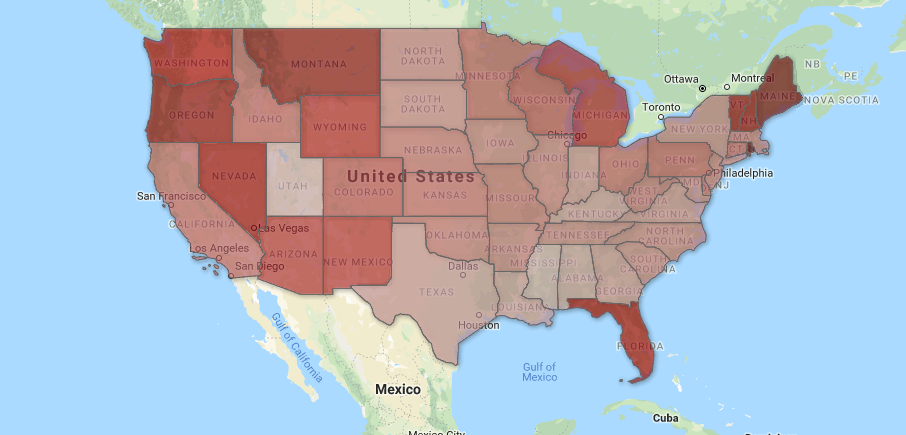

In 2002, Ray-Brent Marsh’s life was ruined. Charged with multiple counts of theft by deception and abuse of a corpse, Marsh hid a third of the hundreds of bodies brought to his crematorium over the years. When asked in court why he had done it, Marsh said, “[if you’re] looking for an answer, I cannot give you one.” In 2007, Marsh’s lawyer McCracken Poston had an answer: mercury poisoning.

While the explanation of a criminal defense lawyer may seem dubious at first, mercury poisoning is well-known to cause bizarre behavior and even insanity. Hatmakers of the 19th century, who used mercury in the manufacturing process, were so often afflicted with mercury poisoning, that it conceived the name “Mad Hatter’s Disease.” 

“I believe that Ray-Brent Marsh, while living and working at the crematory, became a modern-day ‘Mad Hatter,’” wrote Poston in a press release. “An external, environmental cause claimed...the literal sanity and judgment of Ray-Brent Marsh.”

Marsh’s case is just one example of what could be a much larger issue. Due in part to the softening of religious expectations surrounding death, and the high costs associated with conventional burial, cremation has become increasingly popular. According to the National Funeral Directors Association (NFDA), 2015 was the first year on record where cremation eclipsed burial as the most widespread method of body disposal. However, as the prevalence of cremation grows, the environmental and public health impact of the practice grows, too. 

*According to the 2018 NFDA Cremation and Burial Report, cremation will account for nearly 80 percent of all body disposals by 2035 (2020-35 are projections).*

The costs that go into a traditional burial can be daunting. Cremation can save an ordinary consumer nearly $10,000, which has contributed to its recent increase in popularity. 

*The median costs for a traditional burial funeral, totalling over $16,000 according to 2018 NFDA Cremation & Burial Report. Cremation, in comparison, typically costs less than $6,500.*

This increase, when combined with the absence of regulations within the cremation industry and the prevalence of mercury in dental fillings and medical devices such as pacemakers (both extremely common in the elderly who are soon to be cremated), suggests a massive increase in mercury emissions could lie ahead. But mercury is not the only concern. Carbon dioxide and other toxins emitted from cremation, alongside the nonexistent regulations, also contributes to the environmental damage according to researcher Alexis Cain. 

Data from the Cremation Association of North America (CANA) shows that there were just over a million cremations in 2011. A conservative average of mercury released per cremation is 2.9 grams - although some scientists have observed as much as [8.6 grams released](https://www.ejnet.org/crematoria/reindl.pdf). This means over three metric tons of mercury are being released by cremations annually - more than 10 times the current EPA estimate. This calculation is supported by a 2007 paper by former EPA scientist Alexis Cain, who arrived at a very similar number. Cain said that the EPA’s estimate is based on tests which measured the output of mercury from stacks, but that the tests had a very small sample size and may not have even been accurate.

*Per capita  mercury emissions from cremation as of 2011. Rhode Island, Maine and Montana lead the nation, each with over 1.6 kilograms per 100,000 residents.* 

“The issue is cremating one body at a time,” Cain said. “Measuring one stack burning one body isn’t going to give an accurate estimate. The mercury has to go somewhere.”

Cain said that almost all of the mercury in the body would end up being released into the air and not stay in the ashes of the deceased. 
“Mercury is very volatile at room temperature,” he said. “It evaporates easily. [The idea that it might not all be released] seems very unlikely to me.”

When those fumes are released, they can harm both the environment and the cremator. When the hair of Ray-Brent Marsh was tested for mercury contamination, his results gave telltale signs of a massive previous mercury exposure. Marsh’s father, the previous owner of the crematory, died suffering from a number of unexplained medical conditions. His father’s “Parkinson’s-like” symptoms, neuropathy, and declining mental health were classic signs of mercury poisoning. 

Mercury, however, is not the only environmental problem with cremation. According to the Calgary Co-Operative Memorial Society, organic compounds are also emitted from cremation, which react with other toxins under combustion conditions to form polychlorinated dibenzodioxins and polychlorinated dibenzofurans, both of which are carcinogens. A study by CANA found standard filtering techniques for crematorium fumes had little effect on the toxins released.  

Cremations also contribute to global warming. Every cremation produces 180 kilograms of carbon dioxide - equal to burning 20 gallons of gasoline, according to CANA’s Executive Director Barbara Kemmis. “It’s the equivalent of heating a home for a week,” she said.

*Estimated carbon dioxide emissions from cremation (based on CANA figures).*

Making matters worse, regulations of the cremation industry are lax at best. There are no federal laws regulating mercury or carbon dioxide emissions from crematories, and most states have not acted either. 

“Cremators don’t have any controls designed to remove mercury,” said Cain. Other countries have recognized the harmful effects of cremating corpses with dental amalgam. Scotland, for instance, requires dental fillings and medical devices to be removed prior to cremation. There is no such standard in the United States. 

Traditional burial is not necessarily a better alternative.  According to the Berkeley Planning Journal, traditional burials in the United States use 30 million pounds of hardwood, 2,700 tons of copper and bronze, 104,272 tons of steel, and 1,636,000 tons of concrete for vaults and caskets annually. The wood alone needed for caskets, is “equivalent to 4 million square acres of forest, which contains enough trees to...supply the wood needed to build over 90,000 homes”, according to [safepassageurns.com](https://safepassageurns.com/). That’s an area almost twice the size of Yellowstone National Park. 

Worse still, the embalming process releases toxic chemicals such as formaldehyde, glutaraldehyde, phenol and many others. According to the NFDA, burials leak 827,000 gallons of formaldehyde-based embalming fluids into American soil and waterways each year. The same chemicals are used to finish the wood on caskets. Burial can even have a higher carbon dioxide emissions rate than cremation, but the issue is a matter of debate, and “depends on which formula you use,” according to Kemmis. 

However, there are environmentally friendly alternatives that are gaining popularity. On such alternative is “green burial,” which involve simply wrapping the body in cloth and burying it without a casket or embalming fluid. Another option is “biocremation,” which uses a low-energy chemical process to cremate the body without releasing mercury. 

The environmental damage done by cremation is a quiet topic. Beside single hearing before the House Subcommittee on Domestic Policy in 2008, federal and state governments have kept relatively silent on the issue. The long-term damage remains to be seen, but Cain says it’s still cause for concern. 

“The mercury issue will solve itself in the very long term as people get fewer amalgam fillings,” Cain said. “But for now, it’s a real issue.”
