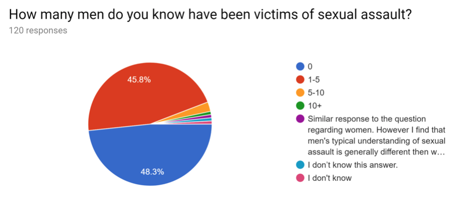
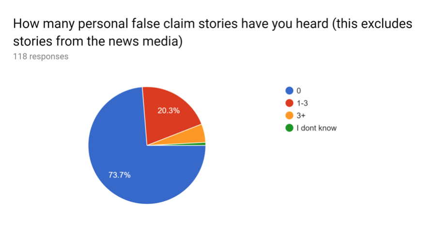
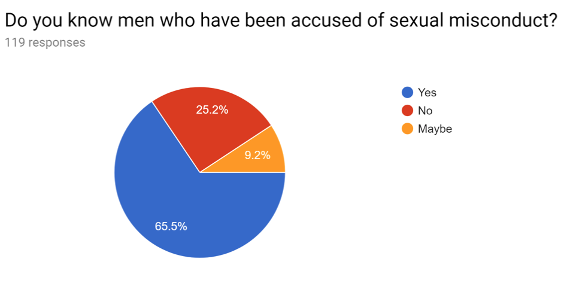

There is a core lack of understanding when it comes to themes of sexual violence and sexual assault, and it stems from the fact that we as society have backdoored sex into something that isn’t supposed to be discussed, and therefore leads to a lack of necessary discussions when it comes to topics involving sex which includes Sexual Assault. We do the women in our society, who are the obvious victims, and men the not so obvious victims, of sexual violence a disservice when we refuse to educate ourselves on these topics, and choose to remain ignorant. The purpose of this article is not to pull on heartstrings, but rather to encourage those who have convinced themselves that sexual violence, harassment, or misconduct is something that only happens to a select group of people, or in the unfortunate instance with the #Metoo movement, women just lying for fame. There is a bigger conversation that needs to be had about how sex is treated in this country and how that plays into why Americans do not take instances of sexual misconduct seriously, but that is an article for another day. 

To assist me with this article I sought the help of American Universities Offices of Advocacy Services for Interpersonal and Sexual Violence (OASIS). 

## Understanding

I began my research into this topic, by conducting a survey in which I aimed to gauge at what level people understood, and interacted with sexual assault and misconduct. The survey was broken up into three sections. The first section attempted to interact with those who have been victims of sexual assault. The second part was a look into how sexual misconduct appeared in their everyday lives, and the last section attempted to see if people understood commonly used terms when it comes to sexual assault. There are many terms involved in the unpacking of sexual misconduct. Corrosion, consent, exploitation, harassment, and the list goes on, but I choose to test on the basic terminology that people in the field of sexaul misconduct use, and the ones that in an ideological world everyone would know what they meant. I asked for the definitions of Rape, Consent, Sexual Harassment, Sexual Assault, and Sexual Misconduct. Out of 120 people only 108 people attempted to define rape and only about 25%  understood what Rape is actually categorized as. 107 people attempted to define consent 100% o those who answered had the basic understanding. But as we unpack later. At the basis of consent, yes, it is an agreement a yes or no to continue on with a specific activity, but there is more to it. 104 people attempted to define Sexual Assault and only about 25% got it right. Sexual Assault is an umbrella term for ANY sexual activity that was not consented to. It does not have to be forceful, groping, and rape are all under this term. Simply smacking someone on the ass is sexual assault. Sexual Harassment had 102 responses, closer to 100% got this right. Sexual Harassment is unwanted vermal and not physical sexual advancement, we usually see this in the workplace, and this was a lot of what Harvey Weinstein was being accused of. Sexual Harassment can be continued sexual advances, even if you are not touching the person. 97 people attempted to define Sexual Misconduct, which trips people up because of how close in definition it is to sexual assault. But what is important to remember that while Assault has to do with physical contact, misconduct encompases everything. From simply telling someone nice ass, catcalling, all the way to forced unwanted touching. People had a tougher time with this definition, less than 25 actually got the definition correct. This shows a big problem, while 120 people is not a valid representation of the American population it still says a lot that most people cannot differentiate, the difference between on and the other. A lot of the responders equated force, and violence to a lot of these terms, which explains why people get themselves into certain situations and lack the realization that what they were doing is legally, and morally wrong. The lack of understanding is what leads people to view sexual assault in the light they do is because they do not understand. When Bill Cosby was sentenced to prison, members of the Black community, questioned why Cosby was sentenced but other were not. Cosby was found guilty of rape, while other were only accused of sexual misconduct, and because we do not understand we group them all as the same. 

## Consent

I have chosen to dedicate a miniature section to consent because as much as the topic has been in public light most people still do not understand what consent is. For example taking the condom off during sex is rape if I did not agree to have sex with you, without a condom. As a sexually active college student, I have had encounters which have almost bordered on misconduct and even almost assault because most of the men I have had as partners have lacked the basic understanding of what is and what is not appropriate. I have had friends express to me, multiple times when they have been forced to either orally pleasure a male partner because they corosed them into doing it by refusing to take no for an answer. Or male partners who have moved their hand onto their genitalia. These stories are not isolated, and they happen quite often. My first time, my partner did not take into the fact that I was telling him no and to e careful because of the pain I was in. Instead he kept going until he was done Now I do not consider myself a victim, but in an alternate world someone else could have been scared by that even, and when we were the done the look on his face made it clear that he did not think he had done anything wrong. When the Aziz Ansari story broke men jumped to defend him because they saw themselves in that Narrative, because they too have done that to women. So what is consent then? If I tell you no, you must stop even if we have already began being intimate with each other. Consent isn’t pushing the topic until I say yes. Men and women when engaging in sexual activity must clearly make sure that their partner is ok with EVERYTHING that is happening. 

## Impact

Sexual Assault Impacts us all on a daily basis, most women interact with different forms of sexaul misconduct on a daily basis, and most people have been victims of sexual assault. When I was in preschool I had boys put their hands down my pants in the middle of class. As a kid it made me uncomfortable, and I did not understand what was happening, and to be honest I do not believe those boys themselves understood what was happening either. In middle school the boys in my class would make a habit of smacking girls on their bottoms, or making comments about breast sizes. As kids we don’t see the problem with this, we laugh it off and call it boys being boys. As a college aged woman, I have been groped at parties, had male genitalia rubbed on me from behind, and pulled without my consent. I have stared at and cat called from cars on my way to class. Sexual harassment has been a part of my story, and the stories of so many others, but we do not acknowledge it because we turn a blind eye. We must begin to become frank about these issues, and I like so many other women even though we have been victims, do not perceive ourselves as victims because we have become desensitized to it. In my survey I asked how many people had been victims of sexual assault, and out of 121 responders about 68% said yes to being victims. What was interesting is that there were people who put no, but only did so because they did not know i their experience could be defined as assault or not. We’re so focused on the belief that assault is forced or violent, that everyday misconduct goes unnoticed, and victims are left questioning if they are actually victims. Out of those who said they were assaulted only about 14% actually reported it and out of that 14% only 15% of the perpetrators were actually punished. I asked people how many women they knew were victims of sexual assault about 40% said they knew about 1-5 women who were assaulted, and about 45% said they knew from about 1-5 men who had been victims. Sexual Assault Impacts us more than we realize. For those who had been victims I asked when the assault happened about 31% said during college. This pushed me to seek out more information from American Universities OASIS, who gave me some numbers, and a new perspective through the conversation we had. 

 
 

 

 

## American University Report Data

 

 

 

 
It is important to note that these numbers are only a representation of those who choose to report, and that a majority of people choose not to report the fact that they were in fact victims, because of facts of shame and fear of retaliation, and even the very real possibility that people will not believe them. 

## False Claim

During my interview with OASIS they noted that fall semester of 2018, they have seen a drop in the number of clients they have, and hypothesized that this may have been a result of the kavanaugh hearings and the fear that when coming forward with their stories. False claim is not as high as you would think it is. Only about 2-8% percent of rape are actually false claim accusations. Sara Yzaguirre who is the coordinator for victim advocacy services, noted that her seven years in this line of work she’s worked with maybe a thousand victims, and not once can she remember one actually attempting to falsely accuse someone. The process of actually accusing someone and the mental toll it takes on someone why would anyone put themselves through that? So why do we buy into the narrative of False Claims? Maya Vizvary, the sexual assault prevention coordinator notes that it might have to do with the fact that the sexual assault stories we often hear are high profile cases. It’s the powerful men we hear about, and think that these women are only accusing these men because they want something “she must want money, she must want fame.” Because of this we prescribe the same thinking to the other stories we hear involving assault. In my survey when I asked how many personal false claim stories people have heard 73 percent said 0. 

  
 

## Combating Sexual Assault

Combating Sexual assault starts with having open conversations, but also addressing issues that we have not addressed before. The first thing we need to know is that rape, and assault are not based in sex, but rather in power. That is why as Ms. Yzaguirre note that 90% of perpetrators are men regardless of if the victim is male or female, and marginalized groups have higher rates of sexual victimization. People commit rape, not because they are sexual deviants that cannot control themselves, but they do it because they can. We combat this issue by actually acknowledging that sexual assault claims are not just from slutty college girls, who got their feeling hurt after the star football player didn’t want to date her after she had sex with him. There is more, we need to denormalize how we view sexual assault. The media plays into this, porn feeds into this, and as a society we internalize and go along with it. 
 
 
 

 

